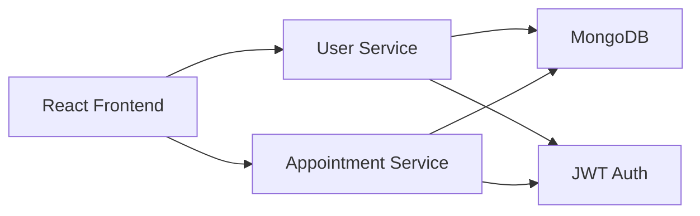

# Architecture Overview

## System Goals
- Allow patients to find doctors and book appointments online
- Allow doctors to manage availability and appointments
- Allow admins to monitor platform activity

## Proposed Architecture

## Backend Modules
- user-service/: authentication, registration, roles, and user management
- appointment-service/: doctor availability, appointment booking, and appointment history
- shared configs and docs for common setup and service communication

## Frontend Modules
- src/components/: reusable UI components
- src/pages/: login, register, doctor list, booking, doctor dashboard, admin dashboard
- src/services/: API integration utilities
- src/context/: auth state and app context

## Security Plan
- JWT-based authentication
- Role-based access for patients, doctors, and admins
- Password hashing and protected routes

## Next Implementation Milestones
1. Initialize backend and frontend projects
2. Create authentication flow
3. Build doctor and appointment models
4. Connect the UI to backend APIs
5. Add testing and deployment documentation
